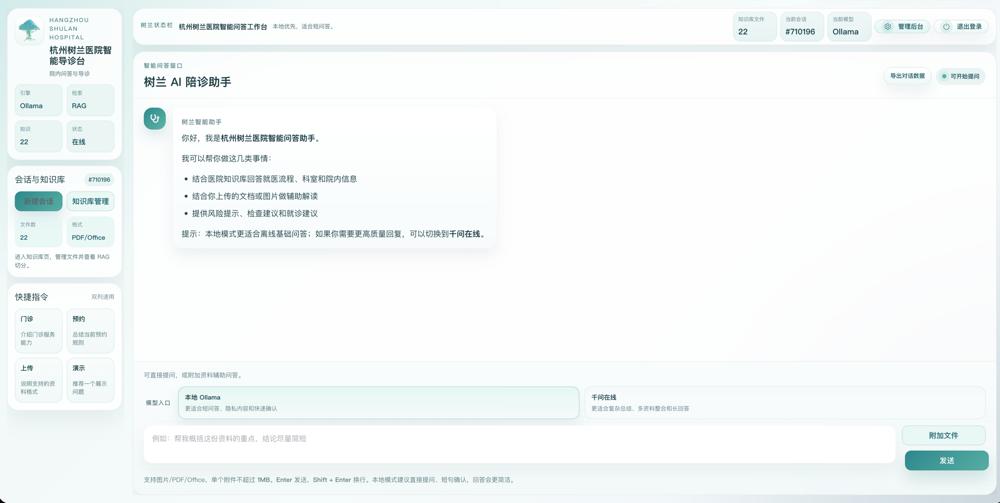
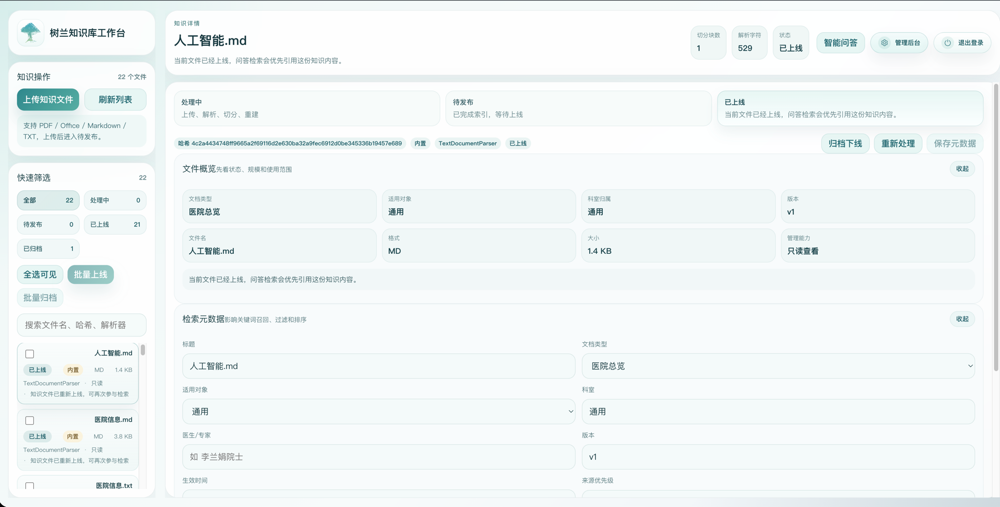

# 🏥 AiHos · 树兰医院智能导诊与知识库平台





AiHos 是一个面向医院场景的智能 Agent 与企业级 RAG 知识库项目，围绕“患者咨询、医生辅助、知识运营、后台管理”四条主线展开。

它不是单纯的聊天 Demo，而是一套完整的医疗问答工作台：

- 💬 面向患者与院内场景的智能问答
- 🧠 基于知识文件、元数据和引用来源的 RAG 检索
- 📄 支持 PDF / Office / Markdown / TXT 等文档入库
- 📚 知识库发布流、归档、重新上线、批量操作
- 👤 登录注册、角色权限、审计日志、管理后台
- 🔭 SkyWalking 链路追踪与检索摘要观测

---

## ✨ 核心能力

### 1. 智能问答与 Agent 工具调用

- 支持本地 Ollama 与千问在线双模型入口
- 支持流式回答、会话隔离、导出 Markdown 对话记录
- 支持预约挂号、取消预约、号源查询等工具调用能力
- 支持图片 / 文件辅助问答

### 2. 企业级 RAG 知识库

- 文档切分、向量化、增量索引
- 混合检索：`关键词召回 + 向量召回 + merge + rerank`
- 回答附带引用来源，便于追溯依据
- 知识文件完整生命周期：
  - `处理中`
  - `待发布`
  - `已上线 / 已归档`

### 3. 管理后台

- 用户管理：启用、禁用、医生账号创建
- 权限管理：`PATIENT / DOCTOR / ADMIN`
- 审计日志：认证、管理操作、聊天摘要、检索摘要
- TraceId 可直接跳转原生 SkyWalking 页面排查链路

### 4. 医疗场景优化

- 支持医院介绍、科室信息、医生信息、流程服务、指南规范等知识类型
- 支持 metadata 管理：文档类型、科室、适用对象、版本、生效时间、关键词、医生名
- 支持知识引用跳转知识详情页，方便运营和校验

---

## 🧱 技术架构

### 后端

- Java 21
- Spring Boot 3.4
- LangChain4j
- MyBatis Plus
- MySQL
- MongoDB
- Redis
- WebSocket / WebFlux
- SkyWalking

### 前端

- Vue 3
- Vite
- Element Plus
- Axios
- Vue Router

### AI 与检索

- 本地模型：Ollama
- 在线模型：阿里云百炼 / 千问
- 向量模型：`bge-m3:latest`
- 向量存储：Chroma
- 检索策略：关键词检索 + 向量检索混合召回

---

## 🧭 当前项目结构

```text
AiMed/
├── aimed-ui/                  # Vue 3 前端
├── config/                    # 本地 / 线上私有配置
├── data/knowledge-base/       # 本地知识文件目录
├── docs/                      # 部署、运行、架构文档
├── scripts/                   # 本地运行、线上部署脚本
├── src/main/java/...          # Spring Boot 后端
├── src/main/resources/        # prompt、内置知识、配置模板
└── sql/                       # 初始化 SQL
```

主要接口入口：

- [ChatController.java](src/main/java/com/linkjb/aimed/controller/ChatController.java)
- [KnowledgeController.java](src/main/java/com/linkjb/aimed/controller/KnowledgeController.java)
- [AuthController.java](src/main/java/com/linkjb/aimed/controller/AuthController.java)
- [AdminController.java](src/main/java/com/linkjb/aimed/controller/AdminController.java)

---

## 🚀 快速开始

### 1. 本地运行

优先参考：

- [快速开始](docs/quick-start.md)
- [本地运行说明](docs/local-run.md)

最常见的启动方式：

```bash
# 后端
mvn spring-boot:run

# 前端
cd aimed-ui
npm install
npm run dev
```

本地默认能力：

- SkyWalking 服务名：`aihos`
- 本地实例名：`aihos-local`
- 本地 Ollama 负责本地问答 / embedding
- 千问在线作为可切换高质量入口保留

### 2. 线上部署

部署与运行文档：

- [线上部署说明](docs/deploy-online-idea.md)
- [SkyWalking 部署说明](docs/skywalking-deploy.md)
- [Chroma 部署说明](docs/chroma-deploy.md)

---

## 📚 文档入口

- [快速开始](docs/quick-start.md)
- [本地运行说明](docs/local-run.md)
- [模块说明](docs/modules.md)
- [SkyWalking 部署说明](docs/skywalking-deploy.md)
- [Chroma 部署说明](docs/chroma-deploy.md)

---

## 📌 当前版本特征

- 知识库支持发布流和归档恢复
- 混合检索已接入
- 引用来源可回溯
- 管理后台支持用户、权限、审计
- 聊天支持本地 / 在线双模型
- 本地与线上都已接入 SkyWalking

---

## 🩺 项目定位

AiHos 更适合作为：

- 医院知识问答工作台
- 门诊导诊与流程咨询入口
- 医生/患者双侧辅助智能体底座
- 企业级医疗知识库运营平台原型

而不是一个单独的聊天页面。

它的重点不只是“让模型说话”，而是让回答**可管理、可追溯、可观测、可发布**。
